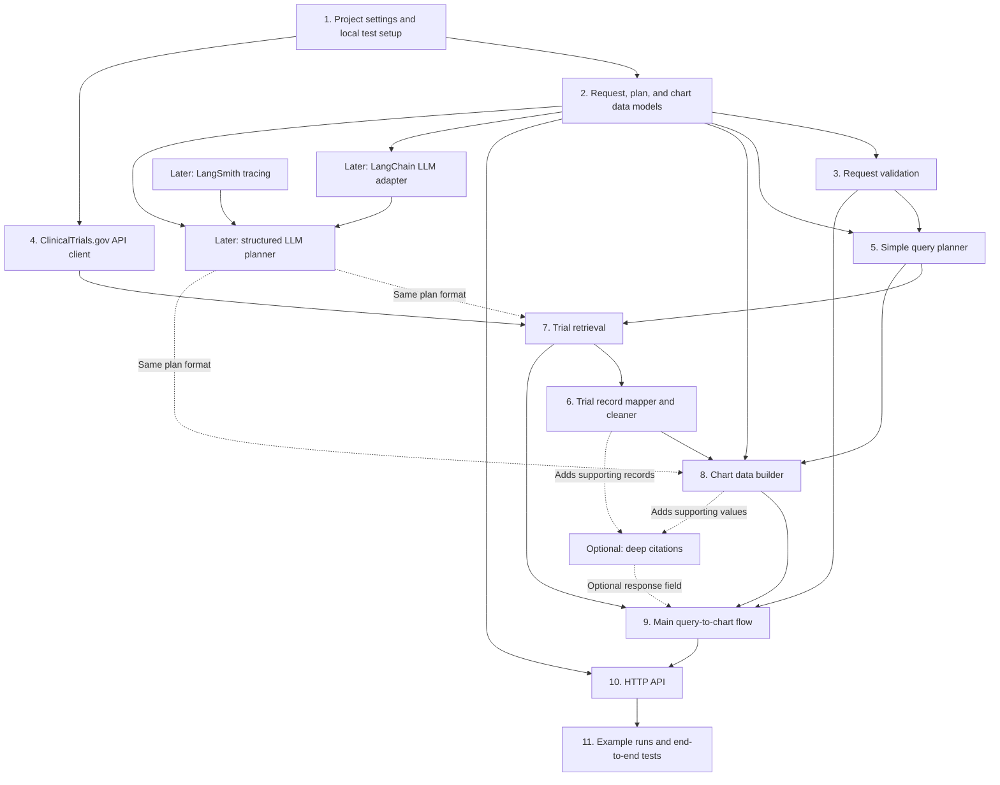

# Simple component build plan

## Goal

Build the backend in small pieces that can be understood and tested on their own. Start with a simple, deterministic version that answers one kind of question correctly. Then add more chart types, source citations, and LLM support without changing the basic flow.

This is a build plan, not a final deployment design. At the start, these should be small Python modules or packages in one backend—not separate services.

## Main idea

Every request should eventually follow this simple path:

1. Check the request.
2. Decide what data and chart are needed.
3. Get trial records from ClinicalTrials.gov.
4. Clean and group the records.
5. Return chart-ready JSON.

The LLM is optional. It may help turn a natural-language question into a plan, but it must not create facts or chart data. ClinicalTrials.gov data and deterministic code remain the source of truth.

## Component DAG

Solid arrows are required for the first working version. Dotted arrows are later additions. The graph has no loops: each component only uses results from earlier components.

## What can be built in parallel

| After this is ready | Build these at the same time | Why this is safe |
| --- | --- | --- |
| Step 2: shared models | Request validation, API client, simple query planner, and record mapper/cleaner | They use the same models, but they do not need each other's code. Each can use small local test inputs. |
| The first parallel group | Trial retrieval and chart data builder | Retrieval uses the planner plus API client; chart building uses the planner plus cleaned fixture records. Neither needs the other component to be tested. |
| Retrieval and chart building | Main query-to-chart flow | This is the first time the components need to be connected. |
| Main query-to-chart flow | HTTP API, example runs, and end-to-end tests | The core behavior is already known. These components expose and protect it without changing its business logic. |
| A working basic flow | Deep citations, LLM planner, and LangSmith tracing | These are optional improvements that use existing contracts and should not block the basic service. |

## Steps to build

### Step 1: Project settings and local test setup

Create the basic Python project settings and a way to run tests locally. Add a small fixture folder with saved, non-sensitive ClinicalTrials.gov responses.

**Why this is required:** Every later component needs a reliable way to be configured and tested. Saved fixtures let us test without relying on the internet or a live API.

**Build and test:** Validate settings, safe defaults, and test discovery. Confirm one simple test can run locally.

### Step 2: Request, plan, and chart data models

Define small validated models for:

- an incoming request, such as `query`, optional drug, condition, and date filters;
- an internal plan, such as “count trials by year” or “count trials by phase”; and
- a chart response, including chart type, title, field mapping, data, and metadata.

**Why this is required:** These models are the contracts between components. They make inputs and outputs clear, stop invalid data early, and let the API, planner, and chart builder change independently.

**Build and test:** Test valid examples, missing required values, invalid filter values, and invalid chart shapes. This work can happen in parallel with Step 1's fixtures.

### Step 3: Request validation

Build a small component that checks the request and turns optional fields into clean filters. For example, reject an end year before a start year and limit very large requests.

**Why this is required:** Bad input should be rejected once, at the boundary, rather than causing unclear errors later in the flow. It also protects the service from unnecessarily expensive requests.

**Build and test:** Test empty queries, invalid dates, invalid phases, conflicting filters, and request limits. This component only needs the models from Step 2.

### Step 4: ClinicalTrials.gov API client

Build one small adapter that calls the ClinicalTrials.gov API. Its job is only to make requests, handle pagination, apply timeouts, and return raw records or clear errors.

**Why this is required:** Keeping API calls in one place makes them easy to test and replace. The rest of the application should not need to know endpoint URLs or raw HTTP details.

**Build and test:** Use mocked HTTP responses to test success, no records, pagination, timeout, rate-limit, and malformed-response cases. This can be built in parallel with Steps 2 and 3 after basic settings exist.

### Step 5: Simple query planner

Start with deterministic rules for a small set of supported questions. For example:

- “trials by phase” becomes a bar-chart plan grouped by phase;
- “trials per year” becomes a time-series plan grouped by start year.

The planner returns the internal plan model from Step 2. If a question is not yet supported, it returns a clear, structured unsupported-query result.

**Why this is required:** This gives the project a correct first path without depending on an LLM. It also defines the exact plan format an LLM must use later.

**Build and test:** Test each supported question pattern, filter handling, ambiguous wording, and unsupported questions. It can be built in parallel with the API client.

### Step 6: Trial record mapper and cleaner

Convert raw API records into a small internal trial record format. Clean values needed by the first chart types, such as NCT ID, start date, phase, intervention, sponsor, recruitment status, and country. Keep the original supporting fields needed for future citations.

**Why this is required:** API data can be nested, missing, or inconsistent. Cleaning it once keeps chart code simple and makes results consistent.

**Build and test:** Use saved API fixtures. Test missing fields, multiple phases/interventions, different date precision, and unknown values. This can be written and tested without a live API.

### Step 7: Trial retrieval

Connect a validated plan to the API client. The retrieval component chooses the correct API filters and fields, enforces limits, and returns the raw records and retrieval metadata.

**Why this is required:** It separates “what the user wants” from “how we call the external API.” This keeps planner rules and API details independent.

**Build and test:** Use a fake API client. Test that each plan creates the expected API request, that limits are respected, and that external errors become clear application errors.

### Step 8: Chart data builder

Take cleaned trial records and a plan, then create the data for one chart. Start with one chart type, such as a phase distribution or yearly trial count. Make grouping, sorting, and treatment of unknown values explicit.

**Why this is required:** This is where real source data becomes a reliable visualization answer. Keeping it pure and separate from API calls makes it the easiest part to test thoroughly.

**Build and test:** Use small in-memory trial records. Test counts, grouping, sorting, empty results, duplicates, missing values, and exact response data. This component should not call the network or an LLM.

### Step 9: Main query-to-chart flow

Compose the earlier components in one application use case:

`request → validation → plan → retrieval → mapping/cleaning → chart data → response`

**Why this is required:** This is the first minimal vertical slice. It proves that the independently tested pieces work together before the HTTP API, more chart types, or LLM behavior are added.

**Build and test:** Use fakes for the API client and planner. Test one full successful request, no-data results, unsupported questions, invalid requests, and dependency failures.

### Step 10: HTTP API

Add a thin HTTP endpoint that reads a request, calls the main flow, and returns the documented JSON response. Keep all business logic in the earlier components.

**Why this is required:** It makes the backend usable by a frontend or example script without mixing web-framework code into domain logic.

**Build and test:** Test request parsing, response schema, status codes, validation errors, and response-size/request-size limits with the main flow replaced by a fake.

### Step 11: Example runs and end-to-end tests

Add three to five example requests and their real JSON outputs. Add an end-to-end local test that uses saved fixtures and runs the HTTP API through the full flow.

**Why this is required:** The assignment requires examples, and this protects the most important user-facing behavior from regressions. Fixture-based tests stay reliable and work locally.

**Build and test:** Run all unit tests, the local end-to-end suite, and schema checks. Keep any live API test separate and optional.

## Add only after the basic flow works

### Optional deep citations

Add citations that attach each chart value to its contributing NCT IDs and exact source fields/excerpts.

**Why later:** Citations are a bonus. Preserving source fields from Step 6 makes them possible, but the basic chart must be correct first.

**Test:** Check that every citation points to the correct source record and supports the displayed number or relationship.

### LLM planner with LangChain

Add a LangChain adapter and an LLM planner only after the deterministic planner works. The LLM must return the same validated plan model as the simple planner. It must never directly create counts, chart data, or citations.

**Why later:** This keeps the first version reliable and gives the LLM a narrow, testable job. If the LLM fails or returns an invalid plan, the service can return a safe error or use deterministic rules where available.

**Test:** Use mocked LLM responses for valid plans, invalid structured output, unsupported requests, prompt-injection attempts, timeout, and retry-limit cases. Live model tests should be separate and controlled.

### LangSmith observability

Add LangSmith tracing around LLM calls and important application runs, with sensitive information removed.

**Why later:** It is useful once LLM behavior exists, but it should not block the basic API-backed chart flow.

**Test:** Confirm traces can be disabled locally and that secrets or sensitive request data are not included in trace metadata.

## Working rules

- Build one small component at a time and test it before connecting it to the next component.
- Use local fixtures, fakes, and mocks for normal development. Do not make unit tests depend on the live API or a live LLM.
- Keep imports one-way: models and core logic do not import HTTP, LangChain, LangSmith, or API-client code.
- Add a new chart type by extending the plan and chart builder, not by adding special cases in the HTTP endpoint.
- Add a test before fixing a bug whenever practical, so the same problem cannot silently return.
- Do not add a database, cache, queue, or separate service until a real requirement shows why it is needed.
